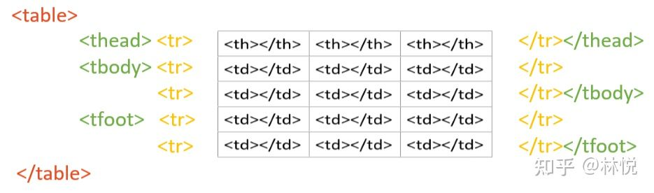

# 1. `<a>`用法
## 常用用法
```html
 <a href="https://www.baidu.com/"> 百度 </a>
 ```
## `<a>`属性

### 1.href(hyper reference) 超引用/超链接。

在href的属性值中添加你想要去的URL，可以是一个网页，一张本地图片，或一张网页图片。如：
```html
 <a href="https://www.baidu.com/"> 百度 </a>
 ```

在属性值中链接页面中的一个标签的id名，就可以实现页面内的跳转，就像很多网页都有一键置顶功能。如：
```HTML
 <nav id="nav"></nav>
 <a href="#nav">一键置顶</a>
 ```

### 2.title

在鼠标悬停时，显示一个自定义文本。有时会用于比如这个链接的名字很长不方便全部展示，那么可以把完整名字写道title，这样用户查看的时候，会更友好。
```html
 <a href="https://www.baidu.com/" title="悬停查看"> 百度 </a>
 ```

### 3.target

此属性用于设定你的网页怎么打开。是在当前窗口还是新窗口。默认使用当前窗口打开，如果想用新窗口打开那就需要写` target="_blank"` 。

当前窗口，不写或使用默认值:
```html
<a href="https://www.baidu.com/" target="_self"> 百度 </a>
```
新窗口打开：
```html
<a href="https://www.baidu.com/" target="_blank"> 百度 </a>
```
### 4.其他用法：

1.用户点击`发送邮件`，唤起本机默认的邮件程序。
```html
<a href="123123123@qq.com">发送邮件</a>
```

2.用户点击 `客服电话` ，唤起本机默认的拨号界面，手机端常见此功能。
```html
<a href="tel:123123123">客服电话</a>
```

# 2. ``图像标签
``标签用于引入图片，它的属性可以设置图片的相关信息，它是一个单标签，没有闭合标签。
```html
 
 ```
### 1.src（source）属性

相当于`<a>`标签的URL，不同的是URL代表你要去哪，src代表你从哪来,就是这个图片的地址，这个地址可以是本地地址，也可以网络地址，这里我们插入一张本地图片(qqq.png)，它的地址和html文件目录相同。
```html
 
 ```

### 2.alt属性

这个属于是文字备胎，当图片显示不出来的时候显示它。

```html
 
 ```

### 3.width 和 height

width代表图片宽度，height代表图片高度。

需要注意的是这里图片宽高设置，并非是CSS。只写其中一项属性，比如只写宽，那么高度就会自适应，如果两个都写，那么两个就都会生效，但是容易造成出现图片变形的情况。
``` html
 
 ```

### 4.title属性

鼠标悬停图片时显示自定义文本，和`<a>`标签一样


# 3.`<table>`表格标签
使用表格的方式展示数据，实现这个标签需要多个标签嵌套，所以我们先使用级数来划分它。

`<table>`：为一级，表示这是一个表格。

`<thead><tbody><tfoot>`：为二级，负责表格中的分区。

`<tr>`(table row)：表行，为三级，代表新建一行。

`<th>`(table head)表头，数据名，自带字体加粗 `<td>`(table data)表体，数据信息：为四级，负责具体的表格项。

由于表格较其他来说标签众多，且嵌套复杂，所以我画了一张图，直接用图来表示：


红色为一级标签，绿色为二级，黄色为三级，黑色为四级。
<table>并不会自带边框，需要我们手动设置边框以及边框的样式。

## 个人感想：
HTML代码像是一个套娃，一个套一个，一层套一层，这一层该负责什么，下一层该负责什么，这一层中的某一个区域该负责什么，虽然代码条理清晰，但是人难免会晕，所以需要彻底的理解代码编写的本质是什么,且要有顶层设计思维，不然整个结构会很混乱，不利于协同工作。
